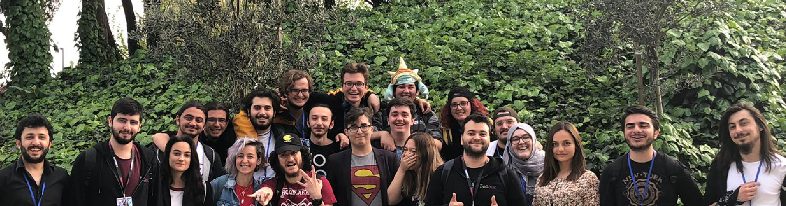

   

   
  

    

      <h3 class="lead"> Hakkımızda </h3>

      

          2013 yılından bu yana faaliyetlerini “Yıldız Teknik Üniversitesi E-spor Topluluğu” ismiyle sürdürmekte olan ve 2015 Haziran itibarı ile “Dijital Oyun Geliştirme ve Dijital Oyunculuk Kulübü” (DOGDOK) ismi ile resmen kurulan kulübümüz, okul içi ve okul dışında, şehir içi ve şehir dışı dahil olmak üzere birçok aktivite gerçekleştirmiştir. Yüzlerce kişinin online ve offline olarak takip ettiği aktivitelerimizde e-spor alanında büyük gelişmelere ve tanıtımlara katkı sağlamıştır. 
      

      

          Dijital oyunculuğun yanı sıra verdiğimiz dijital oyun geliştirme ve programcılık eğitimleri sayesinde konuya ilgili onlarca insanın bilgi sahibi olması ve eğitimi sağlanmıştır. 
      

      

          Kulübümüz oyuncuları ve oyun geliştiricileri bir araya toplayarak hem üretici hem de tüketici kitlenin birlikte çalışması olanaklarını ortaya koymuş ve piyasanın tüketicisinin isteklerini göz önünde bulundurabilen, ilgi çekebilen üreticiler yetiştirilmesine katkıda bulunmuştur. 
      

    

    

        <h3 class="lead" id="anchor1">  Vizyonumuz </h3>
        

        
E-spor Alanında;

          
➢ Türkiye'yi temsil edebilecek, yetenekli ve eğitilmiş e-spor takımları
            oluşturmak. Bu takımların uluslararası alanda başarılı olabilmesine yardımcı
            olacak eğitimi ve çalışma ortamını sağlamak.

          
➢ E-sporun dünya çapında spor olarak kabul edilmesi kapsamında yeni oyunların
            piyasaya çıkarılmasına ve bu oyunları sporcu olarak oynayan e-sporcuların
            yetiştirilmesine katkı sağlamak.

          
➢ Hali hazırda yapılmakta olan şehirler arası turnuvalarımızın kapsamını
            uluslararasına yükselterek, gelişmekte olan e-spor alanına Türkiye’nin de dahil
            olabilmesine yardımcı olmak.

        
Dijital Oyun Geliştirme Alanında;

          
➢ Oyun sektöründe tüketici olarak rolü çok büyük olan Türkiye’nin oyun
            geliştirme alanında da üst seviyelere çıkabilmesine destek olmak.

          
➢ Oyun sektörüne iyi eğitilmiş oyun geliştiriciler yetiştirerek onların piyasada
            yer alabilmelerine imkan sağlamak.

          
➢ Piyasaya sadece eğlence amaçlı değil, eğitici ve öğretici oyunların da
            üretilmesinde rol oynamak.

         
        <h4>Misyonumuz</h4>

        
Üyelerimizin;

          
Dijital oyuncuların adil bir ortamda ve sportmence yarışabilmeleri için
            turnuvalar düzenlemek, dijital oyunculuğun kapsamları ve dijital oyunlar hakkında
            eğitim, konferans ve seminerler ile mevcut ve yetişmekte olan dijital oyunculara
            yol gösterici olmak, kuracağımız bootcamp ile oyuncuların antrenman
            yapabilecekleri ideal ortamları sağlamak; oyun geliştirme alanında da meraklı ve
            eğitimsiz oyun geliştiricileri eğitmek, onlara oyun geliştirebilecekleri ortamı
            sağlamak, ihtiyaçları olan yazılımsal ve donanımsal desteklere ulaşabilmeleri için
            gerekli şirketlerle bağlantılarını kurmak esas amacımızdır.

    
  
  
    

  