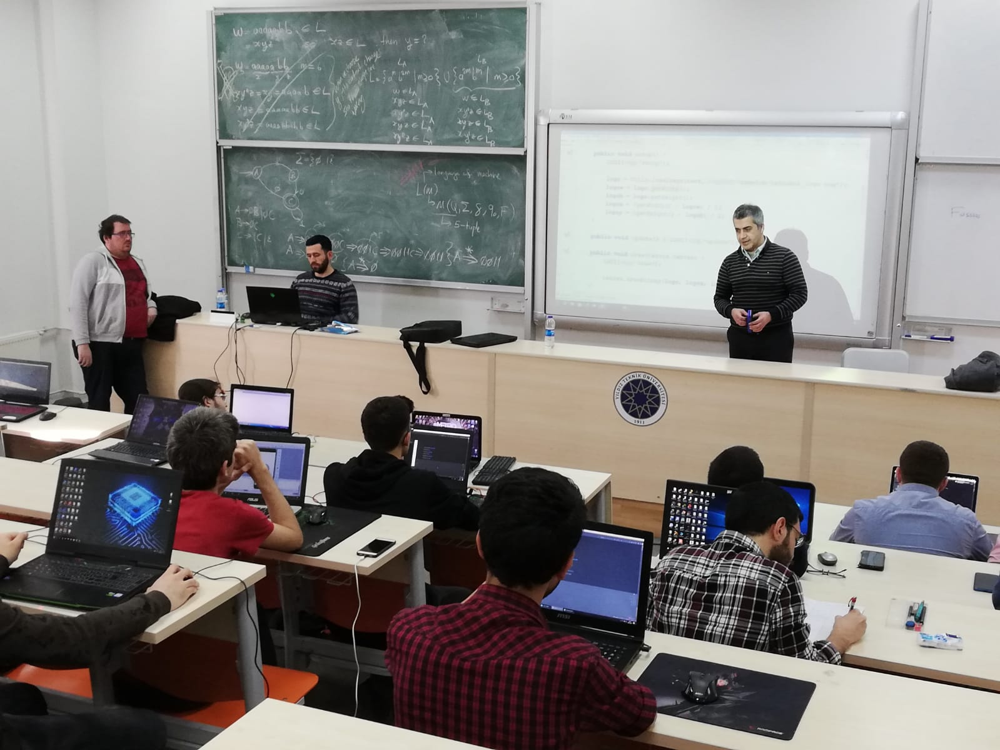
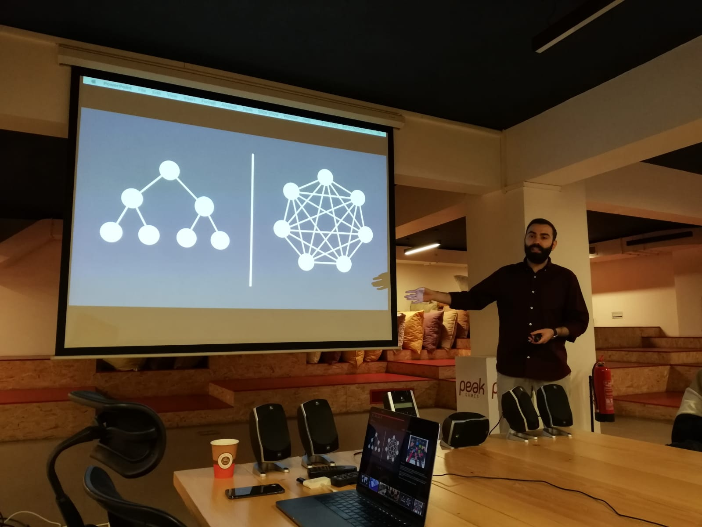

    

        <h1 class="blog-title">
            <i class="fa fa-file-text"></i>
            Game Night
        </h1>
         
        
         
        
Game nightlarimiz en temel etkinligimiz olabilir. Etkinligimiz bir gece erzagimizi depolayip bir gece boyunca
            bir
            internet kafede kepenkleri indirip oyun oynamak, arkadaslarla sohbet etmek, turnuvalar düzenlemekle geciyor.
            Bu
            geceler bizim için cok onemli cünkü arkadasliklarimizi gamenightlarda sekilleniyor. Lenovo GameON gibi
            tanınmıs
            internet kafelerde gerçekleştiriyoruz bu etkinligimizi ve cok egleniyoruz.

        

            alice
            story
            personal
            warning
        

    

    

    

        <h1 class="blog-title">
            <i class="fa fa-file-text"></i>
            Egitim
        </h1>
         
        
         
        
Egitimlerimiz bir sınıfta bir ogretmen esliginde hep beraber cesitli oyun dillerini ogreniyoruz. Bu
            ogrendiklerimiz bize ileride tabii ki cok degerli bir yetenek olarak donecek. Ayrica kim bilir belki bir iş
            kapisi
            da olabilir. Bu egitimleri tamamen ucretsiz bir sekilde saglayacagız uyelerimize. Ayrıca egitimlerimizde de
            cok
            egleniyoruz giris ve cikislarinda yine hep beraber bir seyler yapiyoruz.

        

            alice
            story
            personal
            warning
        

    

    

    

        <h1 class="blog-title">
            <i class="fa fa-file-text"></i>
            Teknik Gezi
        </h1>
         
        
         
        
Teknik Gezilerimiz bizim daha sektör öğrenme odaklı olduğumuz ve staj imkanları sağlayabildiğimiz bir kısım.
            Gecen sene dort ogrencimize staj imkanı sagladık. Oyunlarin nasil yapildigi hakkinda bilgi sahibi olmak
            isteyen
            arkadaslarimizin teknik gezilerimize katilip hem bilgilenip hem network kazanip hem de bu networkü staj
            hatta is
            imkanina dönüstürmesini amacliyoruz.Gecen sene Peak Games'e gezi düzenlemistik. Katilanlardan ne kadar
            eglendigimizi sorabilirsiniz.

        

        

    

    

    

        <h1 class="blog-title">
            <i class="fa fa-file-text"></i>
            Sosyal Etkinlikler
        </h1>
         
        
         
        
Baslica gelen sosyal etkinliklerimiz mangal, paintball ve çesitli oyun topluluklarinda bulunmak. Mangallarda
            üyelerimiz mobil oyunlarla eğlenirken taze ve sıcak etlerini yiyorlar. Ayni zamanda mangalda sportif
            aktiviteler
            yapiyorlar. Paintball ise FPS tarzi oyunlari seven arkadaslarimiz gercek hayatta bu yeteneklerini deniyor ve
            keyifli vakit geciriyorlar. Her hafta Riot Games Arena'da hep beraber macları izlemeye gidiyoruz. Bu hem
            bizim
            daha da kaynasmamızı hem de aynı zevkleri paylaşan insanlarin daha yakin olmasini sagliyor.

        

        

    

    

